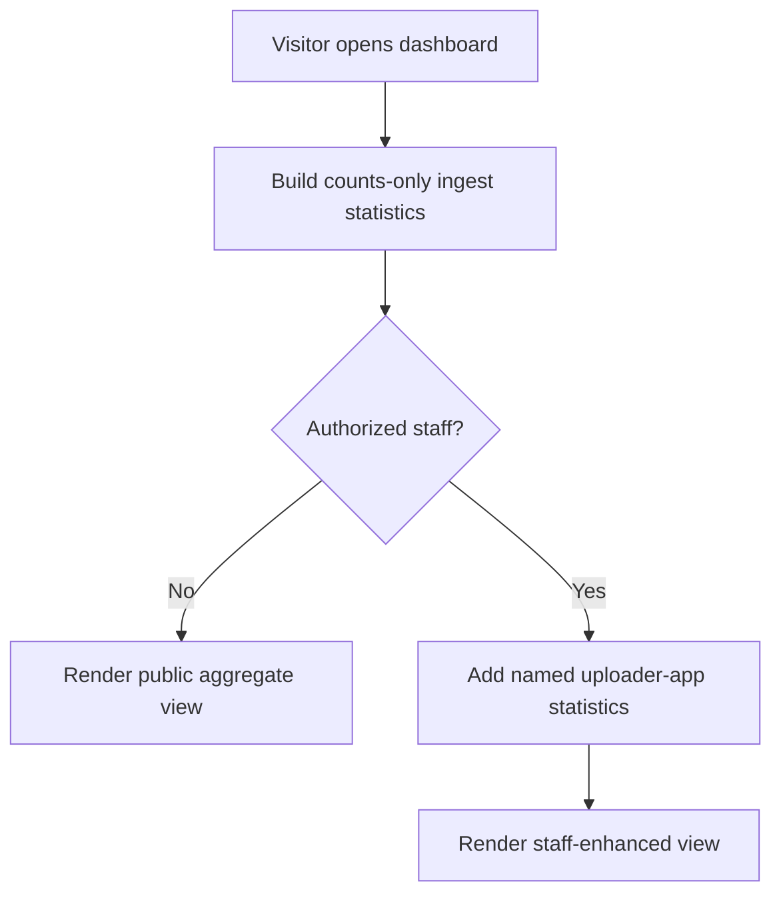
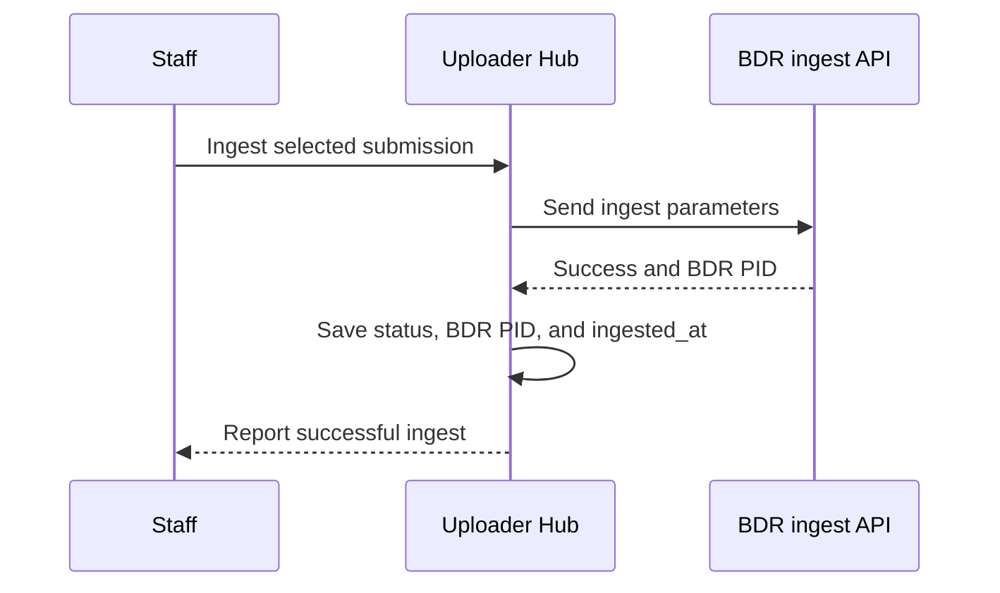

# Usage-statistics ideas for `/dashboard`

This version focuses on **successful BDR ingests**, not uploads, staged submissions, or ingest attempts. The main public visualization is a count of successful ingests by month. Authorized staff can see additional internal detail, including uploader-app names and ingest counts.

All names, months, and counts in the visuals below are illustrative.


## Table of contents

- [Core recommendation](#core-recommendation)
- [Definition of an ingest](#definition-of-an-ingest)
- [Public dashboard](#public-dashboard)
- [Staff-only additions](#staff-only-additions)
- [Additional statistics worth considering](#additional-statistics-worth-considering)
- [Statistics to avoid or defer](#statistics-to-avoid-or-defer)
- [Data-model requirements](#data-model-requirements)
- [Public and staff visibility rules](#public-and-staff-visibility-rules)
- [Presentation details](#presentation-details)
- [Possible implementation shape](#possible-implementation-shape)
- [Tests and edge cases](#tests-and-edge-cases)
- [Recommended first version](#recommended-first-version)


## Core recommendation

Use one `/dashboard/` endpoint with two levels of detail:

- **Public or ordinary authenticated visitor:** aggregate counts only, centered on successful ingests by month. Do not expose uploader-app names, submission titles, collection names, student information, or links that reveal private uploader apps.
- **Authorized staff visitor:** the same aggregate view, plus a named top-ten uploader-app ranking and optional internal filters.

An authenticated student should still receive the public version. “Logged in” and “authorized staff” should be separate checks.



The public page should lead with one chart, not a wall of cards. A few totals can provide context, but the monthly ingest trend should remain visually dominant.


## Definition of an ingest

For this dashboard, one ingest should mean:

> One `Submission` successfully accepted by the BDR ingest API, assigned a BDR PID, and saved locally as successfully ingested.

This definition intentionally excludes:

- a student starting or submitting an upload form;
- a file being staged under `MEDIA_ROOT`;
- a submission waiting with `status='ready_to_ingest'`;
- a failed ingest attempt with `status='ingest_error'`;
- repeated page views, edits, or retries that do not produce a successful BDR ingest.

If an ingest fails and later succeeds, it should count once, in the month of the successful ingest.


## Public dashboard

### Primary visualization: successful ingests by month

A bar chart for the most recent 12 or 24 months is the clearest primary view. Monthly bars make seasonal patterns visible and handle months with no activity naturally.

```text
Successful BDR ingests by month · most recent 12 months

Sep 2025  ███████████████                         15
Oct 2025  █████████████████████                   21
Nov 2025  ████████████                            12
Dec 2025  ██████                                   6
Jan 2026  █████████                                9
Feb 2026  █████████████████                       17
Mar 2026  ███████████████████████████             27
Apr 2026  ████████████████████████████████████    40
May 2026  █████████████████████████████           29
Jun 2026  ██████████████████                      18
Jul 2026  ███████████████████████                 23
Aug 2026  ███                                      3  month in progress
```

Design notes:

- Label the measure explicitly as “Successful BDR ingests,” not “uploads” or “submissions.”
- Show zero-count months rather than omitting them.
- Label the current month as partial or “month in progress.”
- Put exact counts on the bars so the chart is understandable without hover behavior.
- Include a compact accessible table with the same month/count pairs.
- A year selector or “12 months / 24 months / all years” choice could use ordinary query parameters and server rendering; JavaScript is not required for the first version.

### Supporting public counts

Three supporting totals would be useful without overwhelming the chart:

```text
┌──────────────────────┐  ┌──────────────────────┐  ┌──────────────────────┐
│ ALL-TIME INGESTS     │  │ LAST 12 MONTHS       │  │ ACTIVE UPLOADER APPS │
│        1,284         │  │         220          │  │          7           │
│ since tracking began│  │ successful ingests   │  │ with an ingest in 12m│
└──────────────────────┘  └──────────────────────┘  └──────────────────────┘
```

The “active uploader apps” value reveals only a count, not which apps exist. If even the number of active apps is considered sensitive, omit that card.

An alternative third number is **year-to-date ingests**. It is simpler and avoids disclosing how many distinct apps were active.

### Public page wireframe

```text
┌──────────────────────────────────────────────────────────────────────────────┐
│ BDR Uploader Hub usage                                                      │
│ Successful items ingested into the Brown Digital Repository                 │
│                                                                              │
│ All-time ingests: 1,284     Last 12 months: 220     Updated: Aug 3, 2026    │
│                                                                              │
│ Successful BDR ingests by month                          [Last 12 months ▾] │
│                                                                              │
│ 40 ┤                              █                                          │
│ 30 ┤                         █    █  █                                       │
│ 20 ┤    █              █    █    █  █    █                                  │
│ 10 ┤ █  █  █     █     █    █    █  █ █  █                                  │
│  0 ┼──────────────────────────────────────────────────────────────────────   │
│     Sep Oct Nov Dec Jan Feb Mar Apr May Jun Jul Aug*                         │
│                                                        * month in progress   │
│                                                                              │
│ Counts describe successful ingests through this service; uploader-app names │
│ and submission details are not displayed publicly.                          │
└──────────────────────────────────────────────────────────────────────────────┘
```


## Staff-only additions

### Top ten uploader apps by successful ingests

For authorized staff, the most useful additional visualization is a horizontal ranking of uploader-app names and successful ingest counts for the selected period.

```text
Top uploader apps · successful ingests · Sep 2025–Aug 2026

Sample App Alpha       ████████████████████████████████████    64
Sample App Bravo       ███████████████████████████             48
Sample App Charlie     █████████████████████                   37
Sample App Delta       ███████████████                         28
Sample App Echo        ████████████                            22
Sample App Foxtrot     █████████                               17
Sample App Golf        ███████                                 13
Sample App Hotel       █████                                   10
Sample App India       ████                                     8
Sample App Juliet      ██                                       4
All other apps         ███████                                 13
```

Including an “all other apps” bar makes the relationship between the top ten and the full total visible. It should not be treated as an eleventh ranked uploader app.

The staff view could also include a compact table for exact values:

| Rank | Uploader app | Successful ingests | Share of selected period | Most recent ingest |
| ---: | --- | ---: | ---: | --- |
| 1 | Sample App Alpha | 64 | 24.2% | July 2026 |
| 2 | Sample App Bravo | 48 | 18.2% | August 2026 |
| 3 | Sample App Charlie | 37 | 14.0% | June 2026 |

The ranking should default to the same date range as the monthly chart. A staff member should not have to reconcile a 12-month chart with an all-time top-ten list unless the periods are labeled separately.

### Per-app monthly trend

A further staff-only view could let a staff person select one uploader app and see that app's monthly successful ingests. This is useful for understanding seasonality, but it is secondary to the overall chart and top-ten ranking.

```text
Sample App Alpha · successful ingests by month

Sep  ███ 3    Oct  █████ 5    Nov  ██ 2     Dec  0
Jan  █ 1      Feb  ████ 4     Mar  ███████ 7
Apr  ███████████ 11      May  █████████ 9
Jun  ██████ 6   Jul  ████████████ 12   Aug* ████ 4
```

This view should never be sent in the public response, even if hidden with CSS.


## Additional statistics worth considering

### Public-safe possibilities

- **All-time successful ingests:** useful if the start date is stated and historical data is trustworthy.
- **Successful ingests in the last 12 months:** gives an understandable recent total independent of calendar-year boundaries.
- **Year-to-date successful ingests:** familiar, but less meaningful early in January and should not replace the monthly chart.
- **Prior-period comparison:** compare the latest complete 12 months with the preceding 12 months, showing both counts rather than only a percentage.
- **Annual totals:** useful once several complete years exist. Show a yearly chart as an alternate time scale, not immediately below a monthly chart that repeats the same story.
- **Number of active uploader apps per month or year:** safe only if a count of active apps is genuinely non-sensitive.
- **Data freshness:** show when the counts were generated and the last complete month included.

### Staff-only possibilities

- **Top ten uploader apps for a selected year or rolling period.**
- **Share of ingests from the top ten versus all other uploader apps.**
- **Uploader apps with no successful ingests during the selected period.** This could help identify dormant configurations, though “no ingests” is not necessarily a problem.
- **New versus returning uploader apps:** count apps producing their first successful ingest in a period. This requires a stable ingest history.
- **Submission-to-ingest delay:** median days between `created_at` and a new `ingested_at` field. This is an operational measure, not a usage count, and should remain staff-only.
- **Failed ingest attempts by month:** useful operationally, but only after failures are recorded as events rather than inferred from the current final status.


## Statistics to avoid or defer

- **Uploads or submitted files by month:** this is not the requested measure and would mix staged activity with successful BDR ingests.
- **Counts based on `Submission.created_at`:** that timestamp represents submission creation, not successful ingest.
- **Public uploader-app names or rankings:** some uploader apps should not be advertised.
- **Public titles, student names, email addresses, EPPNs, collections, genres, departments, filenames, or BDR PIDs.**
- **A public “recent ingests” list:** even if BDR items later become public, this application should not expose private or restricted workflow details accidentally.
- **Ingest success rate from current status alone:** a submission that fails and later succeeds loses its earlier failure state, so the current model cannot accurately reconstruct attempts.
- **Average monthly ingests without the underlying month counts:** averages hide seasonal usage and zero months.
- **Leaderboards with only percentages:** display exact counts; percentages can supplement them on the staff view.


## Data-model requirements

### A dedicated ingest timestamp is important

The current `Submission` model has `created_at` and `updated_at`, but no dedicated successful-ingest timestamp.

- `created_at` is the submission or upload-confirmation time and must not be used for “ingests by month.”
- `updated_at` is changed whenever the row is saved. It will often coincide with the ingest save today, but a later edit can move the apparent ingest into a different month.
- `bdr_pid` and `status='ingested'` identify a successful current state, but neither records when the successful ingest happened.

For accurate statistics, add a nullable `ingested_at` field and set it only after the BDR API returns success, alongside `bdr_pid` and `status='ingested'`.



### Historical data needs an explicit policy

There are three reasonable options for existing ingested rows:

1. **Start authoritative statistics when `ingested_at` is deployed.** This is cleanest but omits earlier usage.
2. **Backfill `ingested_at` from `updated_at` and label earlier months as estimated.** This preserves a useful historical chart but acknowledges that later edits may have shifted dates.
3. **Recover ingest dates from another authoritative system.** If the BDR records a reliable ingest timestamp keyed by PID, that could support a more accurate backfill, but this should be verified before planning around it.

The public page should state “tracking since [date]” or “historical dates before [date] are estimated” as applicable.

### Deletion and renaming can change history

`Submission.app` currently uses `on_delete=models.CASCADE`. Deleting an `AppConfig` therefore deletes its submissions and removes their ingest counts from history. That is undesirable for durable usage statistics.

Possible remedies include:

- protect uploader apps from deletion when submissions exist;
- retain submissions with a nullable app relationship and snapshot the uploader-app name at ingest time;
- record each successful ingest in a separate immutable event table containing the submission ID, uploader-app ID, uploader-app name at ingest, BDR PID, and ingest timestamp;
- store precomputed monthly aggregates separately if long-term reporting must survive operational-data cleanup.

Uploader-app names are mutable as well. A staff top-ten report grouped by app UUID will preserve identity but display the current name; an immutable ingest event can preserve the historical name if that distinction matters.

### Recommended counting rule

With a dedicated field on `Submission`, count a row only when all of the following are true:

- `status == 'ingested'`;
- `ingested_at` is present;
- `bdr_pid` is present and non-empty.

An immutable successful-ingest event would be even more robust because later administrative edits would not alter the historical event.


## Public and staff visibility rules

| Information | Public or ordinary user | Authorized staff |
| --- | --- | --- |
| Successful ingests per month | Show | Show |
| All-time and recent ingest totals | Show | Show |
| Count of active uploader apps | Optional count only | Show |
| Uploader-app names | Never | Show |
| Top-ten uploader apps | Never | Show |
| Per-app monthly trend | Never | Show |
| Submission titles or people | Never | Prefer existing restricted admin, not dashboard |
| Failed ingest details | Never | Prefer existing restricted admin or a separate operational view |

Important implementation detail: do not build the staff details for everyone and merely hide them in the page. The public response and its template context should contain no uploader-app names.

If public HTML is cached, the cache must not store and serve a staff-enhanced response to anonymous visitors. Separate public aggregate caching from staff-specific rendering, and test this boundary explicitly.

Small-number suppression is optional. Monthly aggregate ingest counts without names may be acceptable, as proposed, but if a month containing one ingest could itself disclose sensitive timing, values below an agreed threshold could be displayed as “fewer than N.” That policy should be decided deliberately rather than added automatically.


## Presentation details

- Default to the latest 12 complete months plus the current partial month, or the latest 12 calendar months with the current month clearly marked partial.
- Use calendar months in the application's agreed reporting timezone. The current settings use `America/New_York` and `USE_TZ=False`; month-boundary tests are still important.
- Fill missing months with zero counts before rendering.
- Put exact counts directly on visual marks and provide an accessible data table.
- Avoid color as the only indicator. One consistent bar color is enough for the public monthly chart.
- If year or date-range controls are added, encode them in the URL so the view can be bookmarked and shared.
- State whether the displayed range includes the current partial month.
- State when data was last calculated and when authoritative ingest tracking began.
- Consider a counts-only CSV download later, but never include app identifiers or names in a public export.


## Possible implementation shape

This is an ideas document rather than an implementation plan, but the repository conventions suggest:

- `config/urls.py`: add `path('dashboard/', views.dashboard, name='dashboard_url')` without `login_required` if the aggregate dashboard is intended to be public.
- `bdr_uploader_hub_app/views.py`: keep `dashboard()` limited to parsing the reporting range, checking staff authorization, calling helpers, and rendering.
- `bdr_uploader_hub_app/lib/dashboard_helper.py`: add separate functions such as `get_public_ingest_statistics()` and `get_staff_ingest_statistics()`.
- Public monthly query: filter only successfully ingested rows and group `ingested_at` with Django's month-truncation database function.
- Staff ranking query: apply the identical date range, group by stable uploader-app identity, count successful ingests, order descending, and limit to ten with deterministic tie ordering.
- `dashboard.html`: render the public chart and totals for everyone; include a staff partial only after the view supplies authorized staff data.
- Prefer server-rendered HTML, CSS, and SVG. A simple date-range form can work without JavaScript.
- Cache only aggregate counts if necessary, with an explicit expiration and safe separation from staff-only data.


## Tests and edge cases

Tests should confirm that:

- a staged or ready-to-ingest submission does not increment ingest counts;
- an ingest error does not increment ingest counts;
- a successful ingest increments exactly one month and the appropriate uploader-app total;
- `created_at` is not used as the ingest month;
- a failed attempt followed by a success counts once in the success month;
- zero-count months appear in the result;
- month boundaries and the current partial month are handled correctly;
- public response content never includes uploader-app names, slugs, UUIDs, or submission information;
- an authenticated student receives only the public view;
- only explicitly authorized staff receive the top-ten section;
- staff top-ten counts use the same selected period as the main chart;
- ties in the top-ten ranking have deterministic ordering;
- public caching cannot leak staff-enhanced content;
- the chosen deletion or history-preservation policy keeps past counts stable.


## Recommended first version

### Public

1. Successful BDR ingests by month for the latest 12 months, with exact values and an accessible table.
2. All-time successful ingests, clearly qualified by “since tracking began.”
3. Successful ingests in the last 12 months.
4. Data freshness and a note that counts represent successful ingests through this service.

### Authorized staff extension

1. Top ten uploader apps by successful ingests for the same period.
2. An “all other apps” count beneath the top ten.
3. Exact counts, percentage share, and most recent ingest month in a table.
4. A year or reporting-range selector shared by the monthly chart and uploader-app ranking.

### Prerequisite

Add a reliable `ingested_at` timestamp and decide how historical ingests and uploader-app deletion should affect long-term statistics. Without that, the chart can be prototyped from `updated_at`, but it should be described as approximate rather than authoritative.

---
